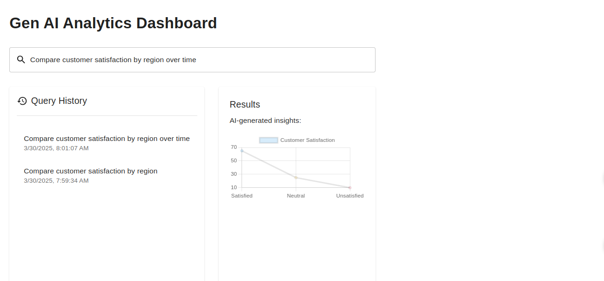

# React + Vite

This template provides a minimal setup to get React working in Vite with HMR and some ESLint rules.

Currently, two official plugins are available:

- [@vitejs/plugin-react](https://github.com/vitejs/vite-plugin-react/blob/main/packages/plugin-react/README.md) uses [Babel](https://babeljs.io/) for Fast Refresh
- [@vitejs/plugin-react-swc](https://github.com/vitejs/vite-plugin-react-swc) uses [SWC](https://swc.rs/) for Fast Refresh

# Gen AI Analytics Dashboard

## Features
- Natural language query input with AI suggestions  
- Dynamic chart visualization  
- Query history tracking  
- Redux state management  

## Live Demo
[Gen AI analytics Dashboard](https://gen-ai-dashboard-beta.vercel.app/)


## Dashboard showing query input, history panel, and dynamic chart visualization




## How to Run

```bash

npm install
npm run dev

```


